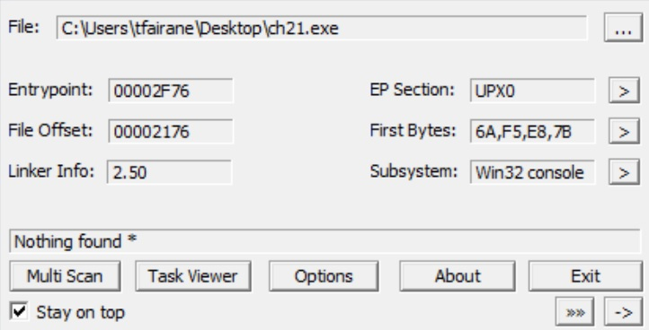
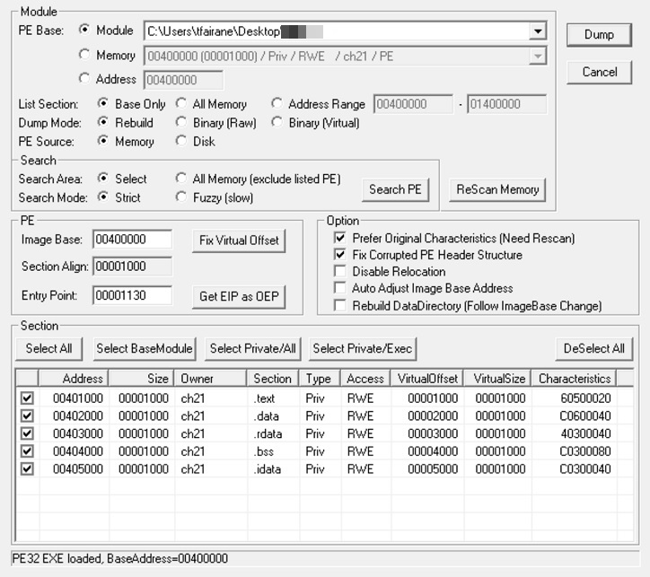
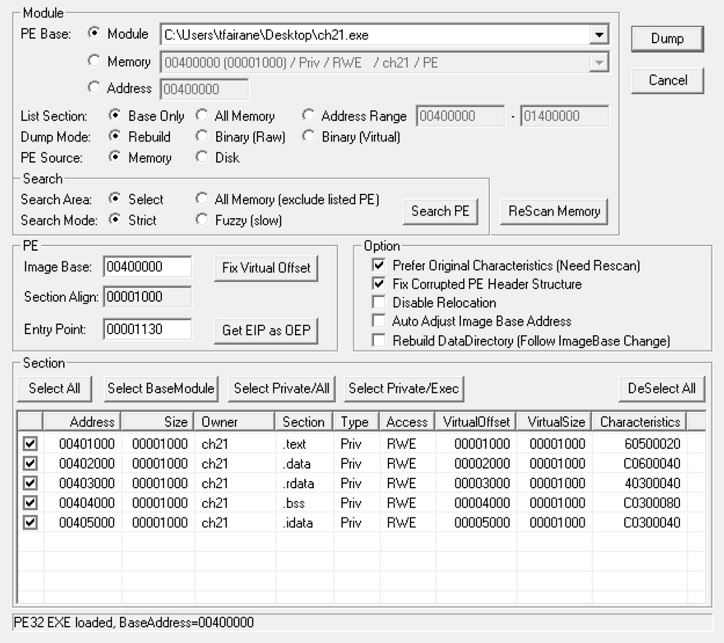

# RunPE (Cracking) www.root-me.org

Bonjour à tous,

Ce papier est un pas à pas pour résoudre le challenge *RunPE* de la catégorie *Cracking* du site www.root-me.org.

Nécessaire :

* Ollydbg v2
* [OllyDumpEx Plugin](http://low-priority.appspot.com/ollydumpex/)
* Un cerveau avec des connaissances sur [RunPE](https://gist.github.com/tfairane/034167792e8d1b044273)

## 0 ) Je ne suis pas UPX

Malgré le nom des sections et les magics, le binaire n'a pas été packet par UPX et PEID nous le confirme.



## I ) BP * `call eax`

* Ollydbg -> open -> ch21.exe
* Search for -> all commands -> `call eax`
* On pose un BreakPoints sur chaque appels et on run la session.

```
00402FB4    FFD0            CALL EAX                                 ; kernel32.VirtualAlloc
0018FF7C  /00000000        ; |Address = NULL
0018FF80  |00002121  !!    ; |Size = 8481.
0018FF84  |00001000       ; |AllocType = MEM_COMMIT
0018FF88  |00000004       ; \Protect = PAGE_READWRITE
```

```
00402CE4    FFD0            CALL EAX                                 ; kernel32.CreateProcessA
0018FF5C   00030314     ; |ApplicationName = "C:\Users\tfairane\Desktop\ch21.exe"
0018FF60   00030514     ; |CommandLine = "bitchesaroundme"
0018FF64   00000000        ; |pProcessSecurity = NULL
0018FF68   00000000        ; |pThreadSecurity = NULL
0018FF6C   00000000        ; |InheritHandles = FALSE
0018FF70   00000004       ; |CreationFlags = CREATE_SUSPENDED
0018FF74   00000000        ; |pEnvironment = NULL
0018FF78   00000000        ; |CurrentDirectory = NULL
0018FF7C   00030000       ; |pStartupInfo = 00030000 -> STARTUPINFOA {Size=0, Reserved1=NULL, Desktop=NULL, Title=NULL, X=0, Y=0, Width=0, Height=0, XCountChars=0, YCountChars=0, FillAttribute=0, Flags=0, ShowWindow=SW_HIDE, Reserved2=0, Reserved3=NULL, hStdInput=NULL, hStdOutput=NU
0018FF80   00030044  D    ; \pProcessInformation = 00030044 -> PROCESS_INFORMATION {hProcess=NULL, hThread=NULL, ProcessID=0 (0.), ThreadID=0}
```

```
00402D14    FFD0            CALL EAX                                 ; kernel32.GetThreadContext
0018FF7C   00000034  4     ; |hThread = 00000034
0018FF80   00030054  T    ; \pContext = 00030054 -> CONTEXT {ContextFlags=CONTEXT_FULL, Dr0=0, Dr1=0, Dr2=0, Dr3=0, Dr6=0, Dr7=0, Float_ControlWord=0, Float_StatusWord=0, Float_TagWord=0, Float_ErrorOffset=0, Float_ErrorSelector=0, Float_DataOffset=0, Float_DataSelector=0, ST0=0.0,
```

```
00402D4C    FFD0            CALL EAX                                 ; kernel32.ReadProcessMemory
0018FF70   00000038  8     ; |hProcess = 00000038
0018FF74   7EFDE008  àý~  ; |BaseAddress = 7EFDE008
0018FF78   00404008  @@   ; |Buffer = ch21.00404008 -> 5D
0018FF7C   00000004       ; |Size = 4
0018FF80   00000000        ; \pBytesWritten = NULL
```

```
00402DF5    FFD0            CALL EAX                                 ; ntdll.NtUnmapViewOfSection
0018FF7C   00000038  8     ; |Arg1 = 38
0018FF80   00400000    @   ; \Arg2 = ch21.<STRUCT IMAGE_DOS_HEADER>
```

```
00402E26    FFD0            CALL EAX                                 ; kernel32.VirtualAllocEx
0018FF70   00000038  8     ; |hProcess = 00000038
0018FF74   00400000    @   ; |Address = 00400000
0018FF78   00006000   `    ; |Size = 24576.
0018FF7C   00003000   0    ; |AllocType = MEM_COMMIT|MEM_RESERVE
0018FF80   00000040  @     ; \Protect = PAGE_EXECUTE_READWRITE
```

```
00402E66    FFD0            CALL EAX                                 ; kernel32.WriteProcessMemory
0018FF70   00000038  8     ; |hProcess = 00000038
0018FF74   00400000    @   ; |BaseAddress = ch21.<STRUCT IMAGE_DOS_HEADER>
0018FF78   00030714     ; |Buffer = 00030714
0018FF7C   00000400       ; |Size = 1024.
0018FF80   00000000        ; \pBytesWritten = NULL
```

```
00402EBE    FFD0            CALL EAX                                 ; kernel32.WriteProcessMemory
0018FF68   00000038  8     ; |hProcess = 00000038
0018FF6C   00401000   @   ; |BaseAddress = ASCII "0.39"
0018FF70   00030B14     ; |Buffer = 00030B14
0018FF74   00000A00        ;  |Size = 2560.
0018FF78   00000000        ; \pBytesWritten = NULL
0018FF7C   0003088C  Π  ; ASCII ".text"
0018FF80   75F8D9B0  °Ùøu  ; kernel32.WriteProcessMemory
```

```
00402EBE    FFD0            CALL EAX                                 ; kernel32.WriteProcessMemory
0018FF68   00000038  8     ; |hProcess = 00000038
0018FF6C   00402000    @   ; |BaseAddress = ASCII "D6@62Es"
0018FF70   00031514     ; |Buffer = 00031514
0018FF74   00000600       ; |Size = 1536.
0018FF78   00000000        ; \pBytesWritten = NULL
0018FF7C   000308B4  ´   ; ASCII ".data"
0018FF80   75F8D9B0  °Ùøu  ; kernel32.WriteProcessMemory
```

```
00402EBE    FFD0            CALL EAX                                 ; kernel32.WriteProcessMemory
0018FF68   00000038  8     ; |hProcess = 00000038
0018FF6C   00403000   0@   ; |BaseAddress = ch21.403000
0018FF70   00031B14     ; |Buffer = 00031B14
0018FF74   00000200       ; |Size = 512.
0018FF78   00000000        ; \pBytesWritten = NULL
0018FF7C   000308DC  Ü   ; ASCII ".rdata"
0018FF80   75F8D9B0  °Ùøu  ; kernel32.WriteProcessMemory
```

```
00402EBE    FFD0            CALL EAX                                 ; kernel32.WriteProcessMemory
0018FF68   00000038  8     ; |hProcess = 00000038
0018FF6C   00404000   @@   ; |BaseAddress = ch21.404000
0018FF70   00030714     ; |Buffer = 00030714
0018FF74   00000000        ; |Size = 0
0018FF78   00000000        ; \pBytesWritten = NULL
0018FF7C   00030904  	   ; ASCII ".bss"
0018FF80   75F8D9B0  °Ùøu  ; kernel32.WriteProcessMemory
```

```
00402EBE    FFD0            CALL EAX                                 ; kernel32.WriteProcessMemory
0018FF68   00000038  8     ; |hProcess = 00000038
0018FF6C   00405000   P@   ; |BaseAddress = ch21.405000
0018FF70   00031D14     ; |Buffer = 00031D14
0018FF74   00000400       ; |Size = 1024.
0018FF78   00000000        ; \pBytesWritten = NULL
0018FF7C   0003092C  ,	   ; ASCII ".idata"
0018FF80   75F8D9B0  °Ùøu  ; kernel32.WriteProcessMemory
```

```
00402F16    FFD0            CALL EAX                                 ; kernel32.WriteProcessMemory
0018FF70   00000038  8     ; |hProcess = 00000038
0018FF74   7EFDE008  àý~  ; |BaseAddress = 7EFDE008
0018FF78   00404014  @@   ; |Buffer = 00404014
0018FF7C   00000004       ; |Size = 4
0018FF80   00000000        ; \pBytesWritten = NULL
```

```
00402F4C    FFD0            CALL EAX                                 ; kernel32.SetThreadContext
0018FF7C   00000034  4     ; |hThread = 00000034
0018FF80   00030054  T    ; \pContext = 00030054 -> CONTEXT {ContextFlags=CONTEXT_FULL, Dr0=0, Dr1=0, Dr2=0, Dr3=0, Dr6=0, Dr7=0, Float_ControlWord=0, Float_StatusWord=0, Float_TagWord=0, Float_ErrorOffset=0, Float_ErrorSelector=0, Float_DataOffset=0, Float_DataSelector=0, ST0=0.0,
```

```
00402F6A    FFD0            CALL EAX                                 ; kernel32.ResumeThread
0018FF80   00000034  4     ; \Thread = 00000034
```

```
00402FE8    FFD0            CALL EAX                                 ; kernel32.Sleep
0018FF80   000003E8  è    ; \Time = 1000. ms
```

## II ) BP sur kernel32.ResumeThread et DUMP du PE

On va utiliser deux instances de Ollydbg :

* La première va s'arrêter sur kernel32.ResumeThread.
* La seconde instance de Ollygdb va s'attacher au processus suspendu et dumper le binaire.



On s'attache au process suspendu et on dump le PE à l'image base 00400000.



Ce qui nous donne un nouveau binaire tout beau, tout propre :3

## III ) Strcmp et final round

Sur ce binaire, EAX provient de argv0.

```
00401527  |.  68 79214000   PUSH OFFSET 00402179                     ; /string2 = "sc>?650xEVD0}_E0&!)"
0040152C  |.  50            PUSH EAX                                 ; |string1
0040152D  |.  E8 A2020000   CALL <JMP.&msvcrt.strcmp>                ; \MSVCRT.strcmp
```

On fait un appel sur la fonction func_00401488 qui permet de décoder la data.

```
00401527  |.  68 79214000   PUSH OFFSET 00402179                     ; string2 = "D4mned_It's_N0t_UPX"
0040152C      90            NOP
0040152D      E8 56FFFFFF   CALL 00401488
```

Et on a gentillement le flag qui s'affiche dans ECX.

```
00402179  44 34 6D 6E|65 64 5F 49|74 27 73 5F|4E 30 74 5F| D4mned_It's_N0t_
00402189  55 50 58 00|                                     UPX
```

Cordialement,

[@tfairane](https://twitter.com/tfairane)
